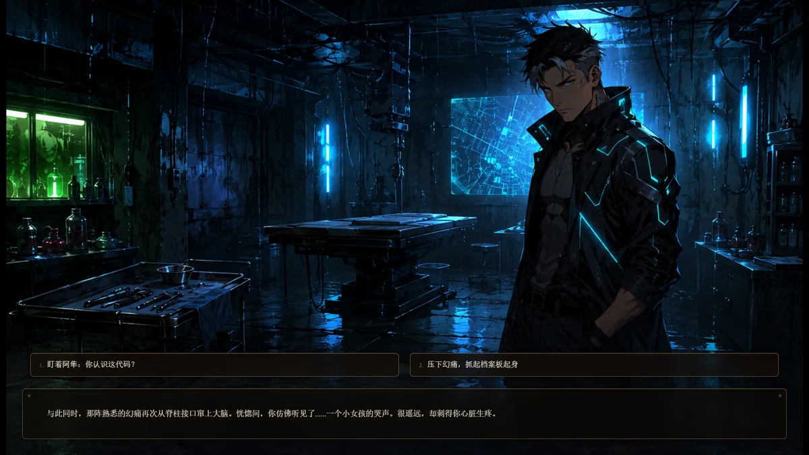
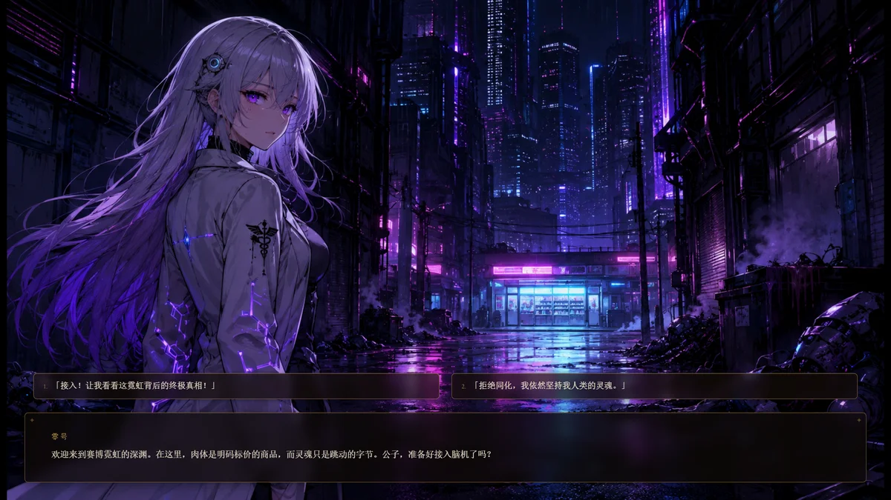
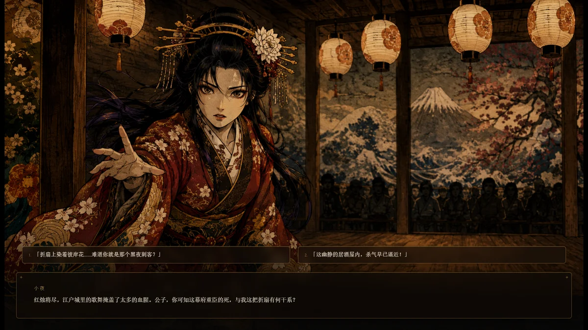
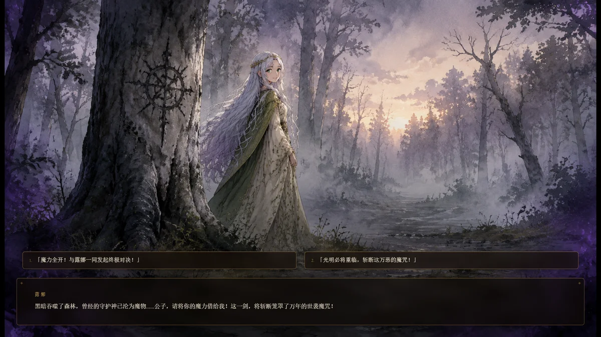
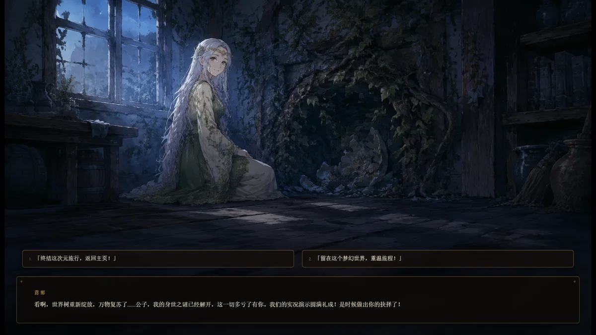
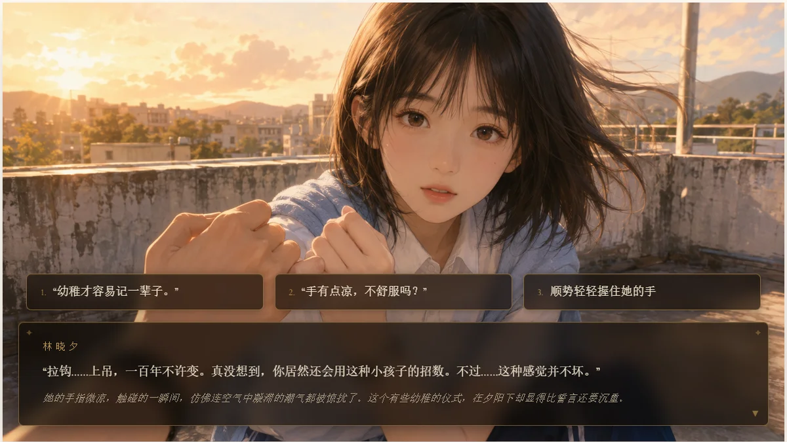
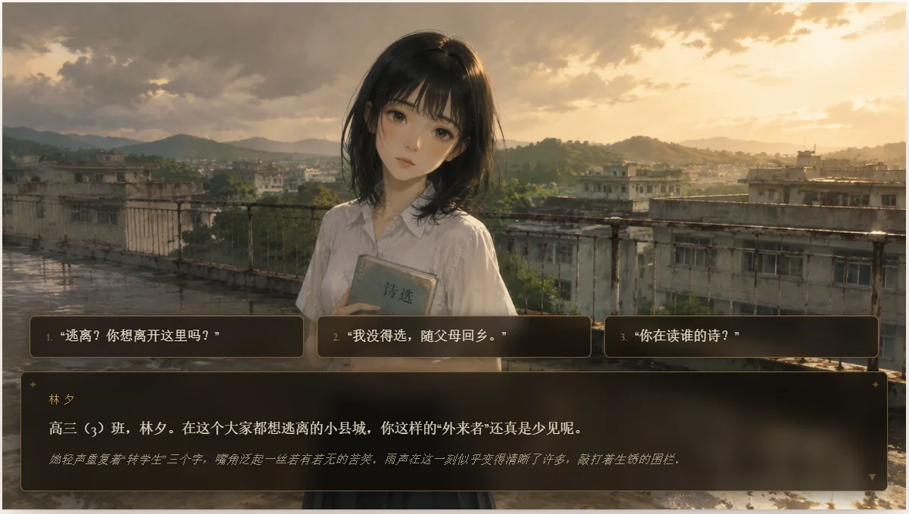
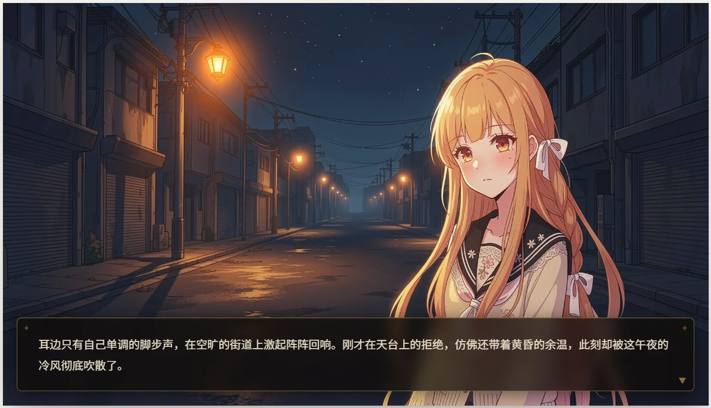
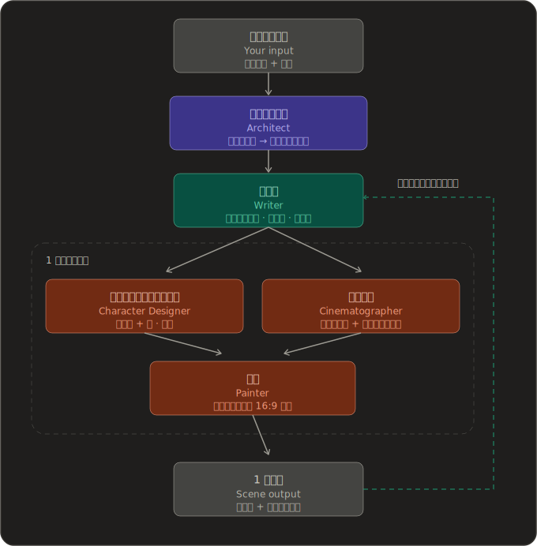
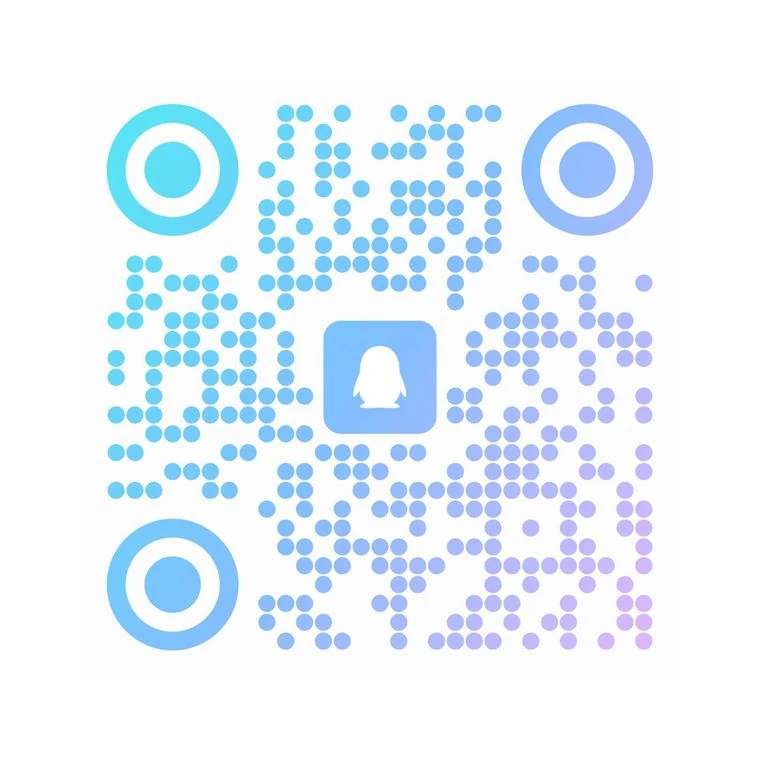

<div align="center">


<p><b>銇傘仾銇熴伄銇熴倎銇儶銈儷銈裤偆銉犵敓鎴愩仌銈屻倠銈ゃ兂銈裤儵銈儐銈ｃ儢銉汇偣銉堛兗銉兗銈层兗銉?/b></p>

[](https://github.com/zonghaoyuan/StoryPlay/stargazers)
[](https://github.com/zonghaoyuan/StoryPlay/watchers)
[](https://github.com/zonghaoyuan/StoryPlay/network)
[](https://github.com/zonghaoyuan/StoryPlay/issues)

[](https://StoryPlay.com)
[](LICENSE)
[![LINUX DO](https://img.shields.io/badge/LINUX-DO-FFB003?style=flat-square&logo=data:image/svg%2bxml;base64,DQo8c3ZnIHhtbG5zPSJodHRwOi8vd3d3LnczLm9yZy8yMDAwL3N2ZyIgd2lkdGg9IjEwMCIgaGVpZ2h0PSIxMDAiPjxwYXRoIGQ9Ik00Ni44Mi0uMDU1aDYuMjVxMjMuOTY5IDIuMDYyIDM4IDIxLjQyNmM1LjI1OCA3LjY3NiA4LjIxNSAxNi4xNTYgOC44NzUgMjUuNDV2Ni4yNXEtMi4wNjQgMjMuOTY4LTIxLjQzIDM4LTExLjUxMiA3Ljg4NS0yNS40NDUgOC44NzRoLTYuMjVxLTIzLjk3LTIuMDY0LTM4LjAwNC0yMS40M1EuOTcxIDY3LjA1Ni0uMDU0IDUzLjE4di02LjQ3M0MxLjM2MiAzMC43ODEgOC41MDMgMTguMTQ4IDIxLjM3IDguODE3IDI5LjA0NyAzLjU2MiAzNy41MjcuNjA0IDQ2LjgyMS0uMDU2IiBzdHlsZT0ic3Ryb2tlOm5vbmU7ZmlsbC1ydWxlOmV2ZW5vZGQ7ZmlsbDojZWNlY2VjO2ZpbGwtb3BhY2l0eToxIi8+PHBhdGggZD0iTTQ3LjI2NiAyLjk1N3EyMi41My0uNjUgMzcuNzc3IDE1LjczOGE0OS43IDQ5LjcgMCAwIDEgNi44NjcgMTAuMTU3cS00MS45NjQuMjIyLTgzLjkzIDAgOS43NS0xOC42MTYgMzAuMDI0LTI0LjM4N2E2MSA2MSAwIDAgMSA5LjI2Mi0xLjUwOCIgc3R5bGU9InN0cm9rZTpub25lO2ZpbGwtcnVsZTpldmVub2RkO2ZpbGw6IzE5MTkxOTtmaWxsLW9wYWNpdHk6MSIvPjxwYXRoIGQ9Ik03Ljk4IDcwLjkyNmMyNy45NzctLjAzNSA1NS45NTQgMCA4My45My4xMTNRODMuNDI2IDg3LjQ3MyA2Ni4xMyA5NC4wODZxLTE4LjgxIDYuNTQ0LTM2LjgzMi0xLjg5OC0xNC4yMDMtNy4wOS0yMS4zMTctMjEuMjYyIiBzdHlsZT0ic3Ryb2tlOm5vbmU7ZmlsbC1ydWxlOmV2ZW5vZGQ7ZmlsbDojZjlhZjAwO2ZpbGwtb3BhY2l0eToxIi8+PC9zdmc+)](https://linux.do)

[绠€浣撲腑鏂嘳(https://github.com/zonghaoyuan/StoryPlay) 路 [English](README.en.md) 路 鏃ユ湰瑾?

</div>

---

## 鈿?姒傝

StoryPlay 銇€丄I 銇屻偝銉炽儐銉炽儎銈掋儶銈儷銈裤偆銉犮伀鐢熸垚銇欍倠銈ゃ兂銈裤儵銈儐銈ｃ儢銉汇偣銉堛兗銉兗銈层兗銉犮仹銇欍€傘亗銈夈亱銇樸倎鐢ㄦ剰銇曘倢銇熺瓔鏇搞亶銈傘偔銉ｃ儵銈偪銉笺倐銇亸銆併仚銇广仸銇屻亗銇仧銇眰銈併伀蹇溿仒銇︺仢銇牬銇х敓鎴愩仌銈屻伨銇欍€?

銇层仺銇撱仺銇ц█銇堛伆銆佺銇熴仭銇屼綔銇ｃ仸銇勩倠銇伅銆丄I 銇屻儶銈儷銈裤偆銉犮伀銈炽兂銉嗐兂銉勩倰鐢熸垚銇欍倠銆嶭ove Is All Around锛堝畬铔嬶紒鎴戣缇庡コ鍖呭洿浜嗭紒锛夈€忋仹銇欍€?

6 姝炽伄瀛愩仼銈傘仹銈傘€?0 浠ｃ伄鑻ヨ€呫仹銈傘€?5 姝炽仹銈傘€?0 姝炽仹銈?鈥斺€?銇撱亾銇伅銆併亗銇仧銇犮亼銇儠銈°兂銈裤偢銉笺亴銇傘倞銇俱仚锛?

銉忋儶銉笺兓銉濄儍銈裤兗銇笘鐣屻仹榄旀硶銈掑銇躲€傚鏍°仹瑾般倐銇屾啩銈屻€佹兂銇勩倰瀵勩仜銈嬪瓨鍦ㄣ伀銇倠銆傘儓銉冦儣瑾屻兓銉堛儍銉椾細璀般伀璜栨枃銈掑嚭銇楃稓銇戙€佺爺绌惰不銇倐浜嬫瑺銇嬨仾銇勩€傘€庡寤枫伄璜嶃亜濂筹紙鐢勫瑳浼狅級銆忋伄涓栫晫銇у寤枫伄椐嗐亼寮曘亶銈掑懗銈忋亞銆傘亗銈嬨亜銇嫢銇勯爟銇埢銈娿€佹倲銇勩伄娈嬨倠銇傘伄閬告姙銈掋倓銈婄洿銇欌€︹€?

---

## 馃寪 銉┿偆銉栥儑銉?

鐒℃枡銇с儣銉偆銆併偦銉冦儓銈儍銉椾笉瑕侊細[StoryPlay.com](https://StoryPlay.com)

---

## 銉囥儣銉偆

StoryPlay 銇鏁般伄銉囥儣銉偆鏂规硶銇蹇溿仐銇︺亜銇俱仚銆傚€嬩汉鍒╃敤銇伅 Vercel 銇儻銉炽偗銉儍銈儑銉椼儹銈ゃ倰銇娿仚銇欍倎銇椼伨銇欍€傝嚜鍒嗐伄銈点兗銉愩兗銈勩儹銉笺偒銉優銈枫兂銇у嫊銇嬨仐銇熴亜鍫村悎銇?Docker 銈掍娇銇ｃ仸銇忋仩銇曘亜銆?

### Vercel / Cloudflare锛堛儻銉炽偗銉儍銈級

Cloudflare 銇搞伄銉囥儣銉偆銇偡銉笺兂銉戙偆銉椼儵銈ゃ兂銇屻倛銈婇暦銇?CPU 鏅傞枔銈掑繀瑕併仺銇欍倠銇熴倎銆乄orkers Paid Plan 銇屽繀瑕併仹銇欍€?

[](https://vercel.com/new/clone?repository-url=https://github.com/zonghaoyuan/StoryPlay&env=TEXT_BASE_URL,TEXT_API_KEY,TEXT_MODEL,IMAGE_BASE_URL,IMAGE_API_KEY,IMAGE_MODEL,VISION_BASE_URL,VISION_API_KEY,VISION_MODEL,TTS_BASE_URL,TTS_API_KEY,TTS_SPEECH_MODEL,MOCK_IMAGE&envDescription=Three%20required%20providers%20%2B%20optional%20TTS.%20Any%20OpenAI-compatible%20endpoint%20works%20for%20text%2Fvision.%20TTS%3A%20Xiaomi%20MiMo%20%28free%29%20or%20StepFun%20%28paid%2C%20better%20quality%29.&envLink=https://github.com/zonghaoyuan/StoryPlay/blob/main/README.ja.md%23%E8%A8%AD%E5%AE%9A%E3%82%AC%E3%82%A4%E3%83%89) &nbsp; [](https://deploy.workers.cloudflare.com/?url=https://github.com/zonghaoyuan/StoryPlay)

銉囥儣銉偆寰屻€佺挵澧冨鏁般倰瑷畾銇椼仸銇忋仩銇曘亜 鈥斺€?涓嬭銇甗瑷畾銈偆銉塢(#瑷畾銈偆銉?銈掑弬鐓с€傘儶銉濄偢銉堛儶銇儷銉笺儓銇屻偄銉椼儶鏈綋銇с仚锛歏ercel 銇с伅鐗瑰垾銇儷銉笺儓瑷畾銇笉瑕併仹銇欍€侰loudflare 銇с伅銉撱儷銉夈偝銉炪兂銉夈倰 `pnpm build:cf` 銇ō瀹氥仚銈嬨仩銇戙仹娓堛伩銇俱仚銆?

### Docker 銉囥儣銉偆锛堛偦銉儠銉涖偣銉堬級

VPS銆併儧銉笺儬銈点兗銉愩兗銆併儹銉笺偒銉優銈枫兂銇蹇溿€倄86 銇?ARM锛圓pple Silicon Mac 銈掑惈銈€锛夈倰銈点儩銉笺儓銆傘儶銉濄偢銉堛儶銇偗銉兗銉炽伅涓嶈銇с仚銆? 銇ゃ伄銉曘偂銈ゃ儷銈掋儉銈︺兂銉兗銉夈仚銈嬨仩銇戙仹濮嬨倎銈夈倢銇俱仚锛?

```bash
mkdir -p StoryPlay && cd StoryPlay
curl -fsSL https://raw.githubusercontent.com/zonghaoyuan/StoryPlay/main/docker-compose.yml -o docker-compose.yml
curl -fsSL https://raw.githubusercontent.com/zonghaoyuan/StoryPlay/main/.env.example -o .env.example
[ -f .env.local ] || cp .env.example .env.local
```

`.env.local` 銈掔法闆嗐仐銇?API 銈兗銈掕ō瀹氥仐锛圼瑷畾銈偆銉塢(#瑷畾銈偆銉?銈掑弬鐓э級銆佽捣鍕曘仐銇俱仚锛?

```bash
docker compose up -d
```

`http://localhost:3000` 銇偄銈偦銈广仐銇︺偛銉笺儬銈掗枊濮嬨仹銇嶃伨銇欍€?

> Compose 銈掍娇銈忋仛銆佺洿鎺ャ偆銉°兗銈搞倰瀹熻銇欍倠銇撱仺銈傘仹銇嶃伨銇欙細
> ```bash
> docker run -d -p 3000:3000 --env-file .env.local ghcr.io/zonghaoyuan/storyplay:latest
> ```

---

## 馃摳 銈广偗銉兗銉炽偡銉с儍銉?

<table>
  <tr>
    <td><a href="docs/assets/screenshots/1.webp"></a></td>
    <td><a href="docs/assets/screenshots/2.webp"></a></td>
  </tr>
  <tr>
    <td><a href="docs/assets/screenshots/3.webp"></a></td>
    <td><a href="docs/assets/screenshots/4.webp"></a></td>
  </tr>
  <tr>
    <td><a href="docs/assets/screenshots/5.webp"></a></td>
    <td><a href="docs/assets/screenshots/6.webp"></a></td>
  </tr>
  <tr>
    <td><a href="docs/assets/screenshots/7.webp"></a></td>
    <td><a href="docs/assets/screenshots/8.webp"></a></td>
  </tr>
  <tr>
    <td><a href="docs/assets/screenshots/9.webp"></a></td>
    <td><a href="docs/assets/screenshots/10.webp"></a></td>
  </tr>
  <tr>
    <td><a href="docs/assets/screenshots/11.webp"></a></td>
    <td><a href="docs/assets/screenshots/12.webp"></a></td>
  </tr>
  <tr>
    <td><a href="docs/assets/screenshots/13.webp"></a></td>
    <td><a href="docs/assets/screenshots/14.webp"></a></td>
  </tr>
</table>

---

## 浠曠祫銇?

銉嗐偔銈广儓銉荤敾鍍忋兓闊冲０銉儑銉倰鍩虹洡銇€佺銇熴仭銇?StoryPlay 銇洰妯欍倰瀹熺従銇欍倠銇熴倎銇優銉儊銈ㄣ兗銈搞偋銉炽儓銉汇儠銉兗銉犮儻銉笺偗銈掓绡夈仐銇俱仐銇熴€傘偍銉笺偢銈с兂銉堛倰 **銈兗銈儐銈儓锛圓rchitect锛夈兓鑴氭湰瀹讹紙Writer锛夈兓銈儯銉┿偗銈裤兗銉囥偠銈ゃ儕銉硷紙Character Designer锛夈兓鎾奖鐩ｇ潱锛圕inematographer锛夈兓绲靛斧锛圥ainter锛?* 銇?5 銇ゃ伄褰瑰壊銇垎銇戙€佷簰銇勩伀閫ｆ惡銇曘仜銈嬨亾銇ㄣ仹銆佺墿瑾炪伄涓€璨€с兓銈儯銉┿偗銈裤兗銇竴璨€с兓銈枫兗銉炽伄閫ｇ稓鎬с倰淇濄仭銇ゃ仱銆併仹銇嶃倠闄愩倞榄呭姏鐨勩仾鐗╄獮銈掔洰鎸囥仐銇俱仚銆?

涓€鍥炪伄銉椼儸銈ゅ叏浣撱倰銆佺銇熴仭銇?*銈广儓銉笺儶銉硷紙story锛?*銇ㄥ懠銈撱仹銇勩伨銇欍€?

鐗╄獮銇竴閫ｃ伄銈枫兗銉筹紙scene锛夈仺銇椼仸灞曢枊銇椼伨銇欍€傚悇銈枫兗銉炽伅銆丄I 銇屾弿銇勩仧 1 鏋氥伄鑳屾櫙鐢汇仺銆佺煭銇勩儞銉笺儓锛坆eat锛夈伄銉勩儶銉?鈥斺€?銉娿儸銉笺偡銉с兂銆併偦銉儠銆併仺銇嶃亰銈娿伄閬告姙鑲?鈥斺€?銇ф鎴愩仌銈屻伨銇欍€傘偡銉笺兂鍐呫伄銉撱兗銉堛倰銈裤儍銉椼仐銇︺亜銇忛枔銆佺敾鍍忋伅銇濄伄銇俱伨鍕曘亶銇俱仜銈撱€傞伕鎶炶偄銇屾湰褰撱伀鏂般仐銇勫牬鎵€ 鈥斺€?鍒ャ伄绌洪枔銆佹柊銇椼亜瑕栫偣銆佹檪闁撱伄璺宠簫 鈥斺€?銇稿皫銇勩仧銇ㄣ亶銇犮亼銆丄I 銇銇偡銉笺兂銈掓弿銇嶃伨銇欍€?

<div align="center">
  
</div>

銇傘仾銇熴亴銇层仺銇ゃ伄銈枫兗銉炽倰瑾倱銇с亜銈嬮枔銇€併偍銉炽偢銉炽伅閬告姙鑲亴灏庛亶銇嗐倠銈枫兗銉炽倰鍏堝洖銈娿仐銇︾敓鎴愩仐銇俱仚 鈥斺€?閬裤亼銈夈倢銇亜娆°伄涓€姝┿伀銇ゃ亜銇︺伅銆併仢銇仌銈夈伀鍏堛伄銈枫兗銉炽伨銇с€傘亗銇仧銇屾柟鍚戙倰閬搞伓闋冦伀銇€併仢銇敾鍍忋伅銇熴亜銇︺亜鎻忋亶涓娿亴銇ｃ仸銇勩倠銇仹銆佸垏銈婃浛銇堛伅涓€鐬伀鎰熴仒銈夈倢銇俱仚銆傘亜銇俱伅銇俱仩澶氬皯銇亝寤躲倰鎰熴仒銈嬨亱銈傘仐銈屻伨銇涖倱銇屻€併仈瀹夊績銇忋仩銇曘亜 鈥斺€?绉併仧銇°伅閶剰鏀瑰杽銇彇銈婄祫銈撱仹銇勩伨銇欍€?

銉溿偪銉炽仹銇仾銇忚儗鏅仢銇倐銇倰銈儶銉冦偗銇欍倠銇ㄣ€併儞銈搞儳銉筹紙vision锛夈儮銉囥儷銈掔祵鐢便仐銇俱仚銆傘偪銉冦儣銇椼仧浣嶇疆銈掕銇垮彇銈娿€併亜銇俱伄銈枫兗銉炽倰鎺㈢储銇椼仸銇勩倠銇亱锛堟柊銇椼亜鐢诲儚銇仐銇с儞銉笺儓銈掓尶鍏ワ級銆佸厛銇搁€层倐銇嗐仺銇椼仸銇勩倠銇亱锛堟柊銇椼亜銈枫兗銉筹級銈掑垽鏂仐銇俱仚銆傘亾銈屻伅 flipbook 銇嬨倝瀛︺倱銇犺泊閲嶃仾鐭ヨ銇熀銇ャ亸銈傘伄銇с€併亾銇鑳姐伅銇勩仛銈?StoryPlay 銈掔壒寰淬仴銇戙倠閸点仺銇倞銆併儣銉偆浣撻〒銈掋倐銇嗕竴娈靛紩銇嶄笂銇掋仸銇忋倢銈嬨仺淇°仒銇︺亜銇俱仚銆?

銈兗銉堛伄涓伀銇€佸緭鏉ュ瀷銇偛銉笺儬 UI 銇竴鍒囩劶銇嶈炯銇俱倢銇︺亜銇俱仜銈撱€侫I 銇€併亗銇仧銇岄伕銈撱仩浠绘剰銇偣銈裤偆銉?鈥斺€?銆屾柟鐪肩礄銇浜洪枔銆嶃仹銈傘€屻偟銈ゃ儛銉笺儜銉炽偗銉汇儙銉兗銉€嶃仹銈?鈥斺€?銇т笘鐣屻倰鎻忋亶銇俱仚銆傘偦銉儠鏋犮仺閬告姙鑲儨銈裤兂銇€併仢銇笂銇噸銇仧杌介噺銇?HTML 銉偆銉ゃ兗銇с€併偡銉笺兂銇仾銇樸個銈堛亞瑾挎暣銇曘倢銇︺亜銇俱仚銆傘仱銇俱倞 UI 銇€佹瘞鍥炲悓銇樸仹銇仾銇忋€併仢銇儣銉偆銇墿瑾炪伀瀵勩倞娣汇仯銇﹀鍖栥仚銈嬨伄銇с仚銆?

---

## 銉併兗銉犮仺銉撱偢銉с兂

绉併仧銇°伅銆佹竻鑿ぇ瀛︺倰銇仒銈併仺銇欍倠澶у銇泦銇嗚嫢鑰呫伄銈般儷銉笺儣銇с仚銆?

涓€鏂广仹銆佺銇熴仭鑷韩銇?galgame銆佷箼濂炽偛銉笺儬銆丗MV銆丄I 銉兗銉儣銉偆銇ㄣ亜銇ｃ仧銈层兗銉犮伄銉樸儞銉笺儲銉笺偠銉笺仹銇椼仧銆傛ソ銇椼伩銇亴銈夈倐銆併倐銇楃瓔鏇搞亶銇屽浐瀹氥仌銈屻仧閬告姙鑲伀绺涖倝銈屻仛銆併儊銉ｃ儍銉堛偄銉椼儶瓒娿仐銇細瑭便仹銇仾銇?AI 銈儯銉┿偗銈裤兗銇ㄦ繁銇忛枹銈忋倢銇熴倝銆併仼銈屻伝銇╂剦蹇仹鍒烘縺鐨勩仩銈嶃亞銇ㄦ兂鍍忋仐銇︺亜銇俱仐銇熴€?

銈傘亞涓€鏂广仹銆佺銇熴仭銇仧銇俱仧銇惧ぇ瑕忔ā銉儑銉伄鎶€琛撱倰灏戙仐銇般亱銈婄悊瑙ｃ仐銇︺亰銈娿€丄I 銇с偄銈ゃ儑銈倰绱犳棭銇忓舰銇仹銇嶃€佹妧琛撱伄閬撶瓔銈勬棦瀛樻妧琛撱仹瀹熺従銇с亶銈嬭＝鍝併伄闄愮晫銇仱銇勩仸銆併仌銇曘倓銇嬨仾鑰冦亪銈掓寔銇ｃ仸銇勩伨銇椼仧銆?

銇嶃仯銇嬨亼銇?2026 骞?4 鏈?22 鏃ャ€乕@zan2434](https://x.com/zan2434) 銇熴仭銇?[flipbook](https://flipbook.page/) 銈掑叕闁嬨仐銇熴亾銇ㄣ仹銇椼仧銆傘亾銇叏銇忔柊銇椼亜銈ゃ兂銈裤儵銈偡銉с兂銇舰銇€佺銇熴仭銇銇嶃€佸績銈掕簫銈夈仜銇俱仐銇熴€?
銇濄仐銇?5 鏈堛伄銇傘倠鏃ャ€佹剰姘楁姇鍚堛仐銆併亾銇嗐仐銇熻＝鍝併倰浣溿倣銇嗐仺姹恒倎銇俱仐銇?鈥斺€?銇嬨仱銇﹁銈併仧骞绘兂銈掑彾銇堛倠鎵嬪姪銇戙倰銇椼仱銇ゃ€併優銉儊銉兗銉€銉儮銉囥儷銇屻倐銇熴倝銇欐柊銇椼亜銈ゃ兂銈裤儵銈偡銉с兂銇舰銈掓帰銈嬨仧銈併伀銆?

銉椼儹銈搞偋銈儓銇伨銇犮仈銇忓垵鏈熴仹銆佸銇忋伄姗熻兘銇屾湭瀹屾垚銇с仚銆俒issue](https://github.com/zonghaoyuan/StoryPlay/issues) 銇с伄銉曘偅銉笺儔銉愩儍銈倰姝撹繋銇椼伨銇欍€傘亗銈嬨亜銇枊鐧恒儊銉笺儬銇姞銈忋仯銇︺€佷竴绶掋伀鏂般仧銇彲鑳芥€с倰鎺倞銆併亗銇仧鑷韩銇ソ濂囧績銈掓簚銇熴仐銇︺亸銇犮仌銇勩€?

銇婂晱銇勫悎銈忋仜锛歨i@StoryPlay.com

**StoryPlay 銉欍兗銈夸氦娴併偘銉兗銉?*锛圦Q 銈般儷銉笺儣鐣彿 `575404333`锛夆€斺€?QR 銈炽兗銉夈倰瑾伩鍙栥仯銇﹀弬鍔犮仐銆併儠銈ｃ兗銉夈儛銉冦偗銈勫叡鍚岄枊鐧恒伀銇斿弬鍔犮亸銇犮仌銇勶細



---

## 瑷畾銈偆銉?

StoryPlay 銇?4 绋銇儮銉囥儷銉椼儹銉愩偆銉€銇ㄩ€氫俊銇椼伨銇欍€?*銉嗐偔銈广儓锛圱ext锛夈兓銉撱偢銉с兂锛圴ision锛夈伅銆佷换鎰忋伄 OpenAI 浜掓彌銈ㄣ兂銉夈儩銈ゃ兂銉?*銈掍娇鐢ㄣ仹銇嶃€佽嚜鐢便伀绲勩伩鍚堛倧銇涖倝銈屻伨銇?鈥斺€?Google Gemini 銈掍娇銇嗗牬鍚堛伅銆乣*_BASE_URL` 銈掋仢銇?OpenAI 浜掓彌銈ㄣ兂銉夈儩銈ゃ兂銉堬紙`https://generativelanguage.googleapis.com/v1beta/openai`锛夈伀鍚戙亼銈嬨仩銇戙仹銇欍€侫nthropic Claude 銈掍娇銇嗗牬鍚堛伅銆佷簰鎻涖偛銉笺儓銈︺偋銈わ紙LiteLLM 銇仼锛夈伄绲岀敱銈掓帹濂ㄣ仐銇俱仚 鈥斺€?Anthropic 銇叕寮忋偍銉炽儔銉濄偆銉炽儓銇?OpenAI 浜掓彌銉偆銉ゃ兗銈掓彁渚涖仐銇︺亜銇俱仚銇屻偔銉ｃ儍銈枫儱闈炲蹇溿伄銇熴倎銆併偝銈广儓銇ㄣ儸銈ゃ儐銉炽偡銇屼笂鏄囥仐銇俱仚銆?*鐢诲儚锛圛mage锛?*銇?**Runware**锛堢嫭鑷伄 task-array 銉椼儹銉堛偝銉級銇?**OpenAI**锛坄gpt-image`锛夈伀瀵惧繙銇椼伨銇欍€?*闊冲０锛圱TS锛?*銇?**Xiaomi MiMo**锛堢嫭鑷伄闊冲０銉囥偠銈ゃ兂/銈儹銉笺兂銉椼儹銉堛偝銉?鈥斺€?銈儯銉┿偗銈裤兗銇斻仺銇煶澹般儑銈躲偆銉炽€併偗銉兗銉炽€佽銇斻仺銇姂鎻氭寚绀恒伀瀵惧繙銆佺劇鏂欙級銇?**StepFun**锛?2 绋伄銉椼儶銈汇儍銉堥煶澹般倰 AI 銇岃嚜鍕曘優銉冦儊銉炽偘銆佹湁鏂欍仹銇欍亴銈堛倞楂樺搧璩級銇蹇溿仐銇俱仚銆?

**1. 銉椼儹銉愩偆銉€銈掗伕銇?*

| 銉椼儹銉愩偆銉€ | 鐠板澶夋暟 | 蹇呴爤锛?| 鎺ㄥエ |
|---|---|---|---|
| Text 路 銈广儓銉笺儶銉肩洠鐫? | `TEXT_BASE_URL` `TEXT_API_KEY` `TEXT_MODEL`        | 鉁?| DeepSeek 銇?`deepseek-v4-flash` |
| Image 路 銈枫兗銉虫弿鐢? | `IMAGE_BASE_URL` `IMAGE_API_KEY` `IMAGE_MODEL`     | 鉁?| [Runware](https://runware.ai) 銇?`runware:400@6`锛團LUX.2 [klein] 9B KV锛?|
| Vision 路 銈儶銉冦偗瑙ｉ噲  | `VISION_BASE_URL` `VISION_API_KEY` `VISION_MODEL`  | 鉁?| Google 銇?`gemini-3.5-flash` |
| TTS 路 銈儯銉┿偗銈裤兗闊冲０ | `TTS_BASE_URL` `TTS_API_KEY` `TTS_SPEECH_MODEL` | 浠绘剰 鈥斺€?绌烘瑒銇倝鐒￠煶銇у嫊浣?| Xiaomi MiMo 銇?`mimo-v2.5-tts`锛堢劇鏂欙級锛涙湁鏂欍伄閬告姙鑲細[StepFun](https://www.stepfun.com) 銇?`step-tts-2` |

**2. 鐠板澶夋暟銈掕ō瀹氥仚銈?*

9 銇ゃ伄澶夋暟銇屽繀闋堛仹銆乀TS 銇换鎰忋仹銇欙紙绌烘瑒銇倝鐒￠煶銇у嫊浣滐級銆備綆銈炽偣銉堛仾銉嗐偣銉堢敤銇儠銉┿偘銈傘亗銈娿伨銇欍€?

| 澶夋暟 | 鍔规灉 |
|---|---|
| `MOCK_IMAGE=true` | 鐢诲儚鐢熸垚銈掋偣銈儍銉椼仐銆併儸銉炽儉銉┿亴闈欑殑銇儣銉兗銈广儧銉儉銈掕繑銇椼伨銇欍€傘偣銉堛兗銉兗銉婚煶澹般兓閬告姙鑲伅閫氬父銇┿亰銈婂嫊浣溿仐銇俱仚銆俁unware 銇偗銉偢銉冦儓銈掓秷璨汇仜銇氥伀 TTS 銈掕鏁淬仚銈嬨伄銇渶閬┿仹銇欍€?|

瑷畾鍫存墍锛堟纰恒仾銉曘偐銉笺優銉冦儓銇?`.env.example` 銈掑弬鐓э級锛?

- **銉兗銈儷闁嬬櫤** 鈥斺€?`.env.local`
- **Vercel** 鈥斺€?Project Settings 鈫?Environment Variables
- **Cloudflare Workers** 鈥斺€?銉儩銈搞儓銉伄銉兗銉堛亱銈夊悇澶夋暟銇仱銇勩仸 `wrangler secret put <NAME>` 銈掑疅琛屻仚銈嬨亱銆併儉銉冦偡銉ャ儨銉笺儔锛圵orkers 鈫?StoryPlay 鈫?Settings 鈫?Variables and Secrets锛夈仹瑷畾銇椼伨銇欍€傘偣銉嗐兗銈搞兂銈扮挵澧冦伀銈偗銈汇偣鍒堕檺銈掓帥銇戙仧銇勫牬鍚堛伅銆乄orker 銇墠銇?[Cloudflare Access](https://developers.cloudflare.com/cloudflare-one/applications/) 銈掓専銈€銇ㄣ€併偧銉偝銉笺儔銇с儭銉笺儷瑷卞彲銉偣銉堟柟寮忋伄瑾嶈銇屽埄鐢ㄣ仹銇嶃伨銇欍€?

**3. 銈炽偣銉堛伀娉ㄦ剰**

鎺ㄥエ銇?3 鐐广偦銉冦儓銇с伅銆佸悇銈枫兗銉炽伄銈炽偣銉堛伅涓汇伀鐢诲儚鐢熸垚銉儑銉伀銈堛倠銈傘伄銇с仚銆侳LUX.2 [klein] 9B KV 銇敾鍍忋伅 1 銈枫兗銉炽亗銇熴倞姒傘伃 **$0.00078**锛?792脳1024銆? 銈广儐銉冦儣銆併偟銉栫锛夈€傘儐銈偣銉堛儮銉囥儷銇?`deepseek-v4-flash` 銈掍娇鐢ㄣ仚銈嬨仧銈併€併儐銈偣銉堛偝銈广儓銇瘮杓冦伀銇倞銇俱仜銈撱€傘偡銉笺兂鍐呫伄銉撱兗銉堛倰銈裤儍銉椼仐銇︺亜銇忋伄銇劇鏂欍仹銇欍€傚垏銈婃浛銇堛倰涓€鐬伀淇濄仱銇熴倎銆併偍銉炽偢銉炽伅閬搞伓鍙兘鎬с伅銇傘倠銇屾渶绲傜殑銇伕銇般仾銇勩偡銉笺兂銈傚厛琛岀敓鎴愩仐銇俱仚 鈥斺€?銇濄伄銇熴倎瀹熼殯銇敮鍑恒伅銆併亗銇仧銇屽疅闅涖伀瑕嬨倠銈枫兗銉虫暟銈堛倞銈勩倓楂樸亸銇倞銇俱仚銆?

**4. 鐢诲儚銉椼儹銈偡锛堛偑銉椼偡銉с兂锛?*

銉囥儠銈┿儷銉堛仹銇儢銉┿偊銈躲亴鐢诲儚銉椼儹銉愩偆銉€銉笺伀鐩存帴銈偗銈汇偣銇欍倠銇熴倎銆佽ō瀹氥伅涓嶈銇с仚 鈥斺€?`NEXT_PUBLIC_IMAGE_PROXY_URL` 銈掔┖娆勩伄銇俱伨銇仚銈屻伆銆併伨銇ｃ仧銇忓奖闊裤亗銈娿伨銇涖倱銆傜敾鍍忋亴銆屼笂銇嬨倝闋嗐伀銆嶈〃绀恒仌銈屻倠鐝捐薄锛堜竴閮ㄣ伄銉嶃儍銉堛儻銉笺偗銇?Chrome 銇?`ERR_QUIC_PROTOCOL_ERROR` 銇倛銈?PNG 銇岃銇斻仺銇弿鐢汇仌銈屻倠锛夈伀閬亣銇椼仧鍫村悎銇伩蹇呰銇с仚銆傚皬銇曘仾 Cloudflare Worker 銈掋儑銉椼儹銈ゃ仚銈嬨仺銆佺敾鍍忋倰銈点兗銉愩兗鍋淬仹鍐嶅彇寰椼仐 HTTP/2 銇т竴鎷繑鍗淬仐銇俱仚銆傘儻銉炽偗銉儍銈儑銉椼儹銈ゃ伅 **[StoryPlay-image-proxy](https://github.com/zonghaoyuan/StoryPlay-image-proxy)** 銈掑弬鐓с仐銆佸嚭鍔涖仌銈屻仧 `workers.dev` 銇?URL 銈?`NEXT_PUBLIC_IMAGE_PROXY_URL` 銇ō瀹氥仐銇︺亸銇犮仌銇勩€?

**5. 銉椼儸銈ゃ儰銉艰嚜韬伄闊冲０ Key锛堜换鎰忋兓鎺ㄥエ锛?*

Xiaomi 銇?TTS 銉儑銉伀 RPM/TPM 鍒堕檺銈掕ō銇戙仸銇勩伨銇欍€傚叕闁嬨儑銉椼儹銈ゃ仹澶氭暟銇儣銉偆銉ゃ兗銇屽崢涓€銇?`TTS_API_KEY` 銈掑叡鏈夈仐銇﹀悓鏅傘伀銉椼儸銈ゃ仚銈嬨仺銆併亾銇埗闄愩伀閬斻仐銈勩仚銇忋€?*銈广儓銉笺儶銉笺倐鐢诲儚銈傛甯搞仾銇伀闊冲０銇犮亼鍑恒仾銇?*銇ㄣ亜銇嗙棁鐘躲伀銇倞銇俱仚銆傚绛栥仺銇椼仸銆併儣銉偆銉ゃ兗銇儓銉冦儣銉氥兗銈搞仹**鑷垎銇?* Xiaomi MiMo Key锛堢劇鏂欍仹鍙栧緱鍙級銈掍换鎰忋仹鍏ュ姏銇с亶銇俱仚銆傚悎鎴愩伅**銉栥儵銈︺偠銇嬨倝 Xiaomi 銇哥洿鎺?*琛屻倧銈屻€?*Key 銇儣銉偆銉ゃ兗銇儢銉┿偊銈跺唴銇伄銇夸繚瀛樸仌銈屻€併亗銇仧銇偟銉笺儛銉笺倰涓€鍒囩祵鐢便仐銇俱仜銈?*銆傘亾銈屻伀銈堛倞瀹夊畾銇椼仧闊冲０銇ㄤ綆閬呭欢銇屽緱銈夈倢銇俱仚銆傚畬鍏ㄣ仾杩藉姞姗熻兘銇с亗銈娿€佹湭鍏ュ姏銇倝銇撱倢銇俱仹閫氥倞銈点兗銉愩兗鍋淬伄 Key 銇儠銈┿兗銉儛銉冦偗銇椼伨銇欍€?

鍙栧緱銉诲叆鍔涖伄鎵嬮爢銇?[闊冲０ Key 鎸併仭杈笺伩銈偆銉塢(docs/integrations/xiaomi-tts-key.md) 銈掑弬鐓с仐銇︺亸銇犮仌銇勩€?

---

## Roadmap

**瀹熻娓堛伩**

- [x] 銉偆銉嗐兂銈枫倰绱?10 绉掋伀鏈€閬╁寲
- [x] 銉撱偢銉с兂銉欍兗銈圭敾鍍忋偆銉炽偪銉┿偗銈枫儳銉?
- [x] 銉兂銈儶銉冦偗銉囥儣銉偆锛嗐偒銈广偪銉犮儮銉囥儷瑷畾
- [x] 銉曘儹銉炽儓銈ㄣ兂銉夈仹 API Key銉汇儮銉囥儷瑷畾
- [x] 銉儛銈ゃ儷 Web 瀵惧繙
- [x] 銈广儓銉笺儶銉煎叡鏈夛紙`.storyplay` 褰㈠紡锛?

**鏈疅瑁?*

- [ ] 銉儛銈ゃ儷銈儣銉紗銈儶銈ㄣ偆銈裤兗銉椼儵銉冦儓銉曘偐銉笺儬
- [ ] ComfyUI 銈偣銈裤儬鐢诲儚鐢熸垚瀵惧繙
- [ ] Open Deploy 銈偆銉冦偗銉囥儣銉偆
- [ ] 銉偆銉嗐兂銈枫倰 5 绉掍互鍐呫伀鐭府
- [ ] 銈广儓銉笺儶銉笺伄淇濆瓨銉诲啀闁?
- [ ] 銈偣銈裤儬銈儯銉┿偗銈裤兗銈兗銉夛紗涓栫晫瑕宠ō瀹?
- [ ] 銉椼儹銉炽儣銉堛偔銉ｃ儍銈枫儱銉掋儍銉堢巼銇渶閬╁寲

---

## 銈广偪銉兼帹绉?

[](https://star-history.com/#zonghaoyuan/StoryPlay&Date)

---

## 銉┿偆銈汇兂銈广仺銈炽兂銉堛儶銉撱儱銉笺儓

鏈儣銉偢銈с偗銉堛伅 [AGPL-3.0](https://www.gnu.org/licenses/agpl-3.0.html) 銇у叕闁嬨仌銈屻仸銇勩伨銇欍€?

銈炽兂銉堛儶銉撱儱銉笺偡銉с兂銈掓瓝杩庛仐銇俱仚锛佸閮ㄣ偝銉炽儓銉儞銉ャ兗銈裤伅銆丳R 銈掋優銉笺偢銇欍倠鍓嶃伀涓€搴︺仩銇戙€婅并鐚€呫儵銈ゃ偦銉炽偣濂戠磩銆嬶紙CLA锛夈伀缃插悕銇欍倠蹇呰銇屻亗銈娿伨銇?鈥斺€?[CONTRIBUTING.md](CONTRIBUTING.md) 銇娿倛銇?[CLA.md](CLA.md) 銈掑弬鐓с仐銇︺亸銇犮仌銇勩€侾R 銈掗枊銇勩仧寰屻€丳R 銇偝銉°兂銉堛仹缃插悕銇с亶銇俱仚銆?
