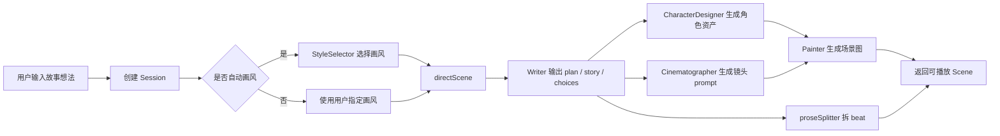
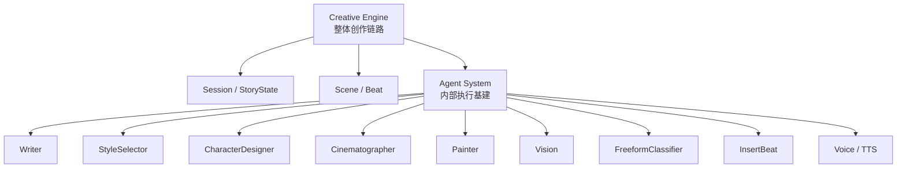
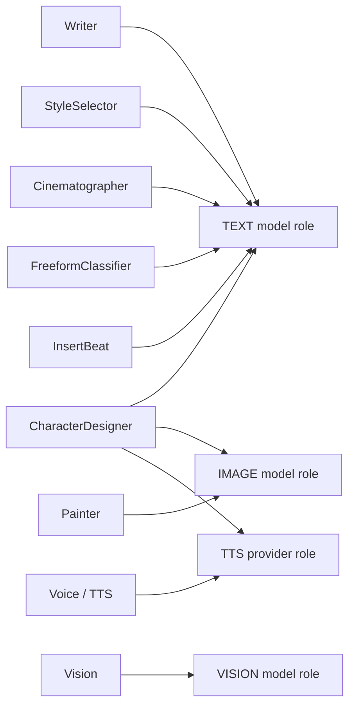
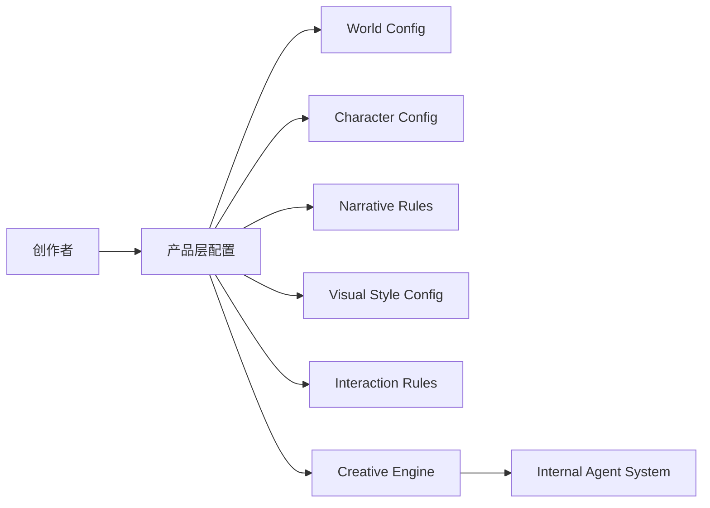

# StoryPlay 创作路径可视化

Status: Visual Aid.

这份文档只用于辅助理解 Creative Engine 的当前运行链路和后续 Creator System 方向，不作为代码事实来源。当前实现事实请优先看 [README.md](README.md) 和 [../agent-system/overview.md](../agent-system/overview.md)。

## 1. 当前最短链路

当前产品更接近“实时故事生成器”：玩家给一个命题，系统生成一幕可玩的视觉故事。它还不是完整的创作者工作台。

## 2. Agent System 在哪里

`agent-system/` 是 Creative Engine 下面的内部基建板块。agent / skill 不给创作者编辑；后续 Creator System 只能产出产品层配置，再由内部 agent 消费。

## 3. 模型 API 对应关系

代码里不是每个 agent 写死模型，而是通过文本、图像、视觉、语音几类 provider / model role 读取配置。后续升级模型时，应按 agent 逐个验证，而不是全局一次替换。

## 4. 当前资产与后续产品化

| 当前已有 | 当前位置 | 后续 Creator System 可产品化为 |
| --- | --- | --- |
| 故事命题 | `Session.worldSetting` | World Config / Story Brief |
| 画风 | `Session.styleGuide` | Visual Style Config |
| 角色 | `Session.characters` | Character Config |
| 故事记忆 | `Session.storyState` | Narrative State / Story Bible |
| 场景与节拍 | `Scene` / `Beat` | Scene Editor / Beat Editor |
| 分支选择 | `choices` | Branch Graph |

Creator System 后续应该编辑的是这些产品层资产，不是底层 agent contract、skill、parser、fallback 或 provider fallback。

## 5. 后续边界

维护原则：

- 改创作链路、Session、StoryState、Creator System 配置：更新 `creative-engine/`。
- 改 agent prompt、parser、fallback、contract、fixture：更新 `agent-system/`。
- 不把创作者配置系统和 agent / skill 系统混成一层。
